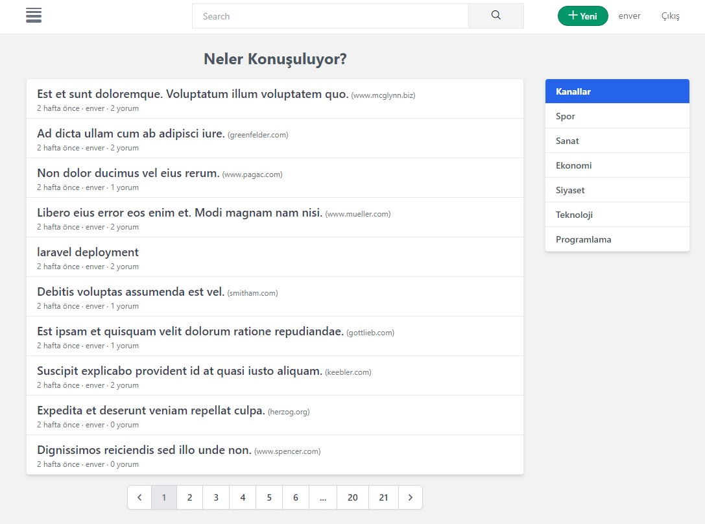
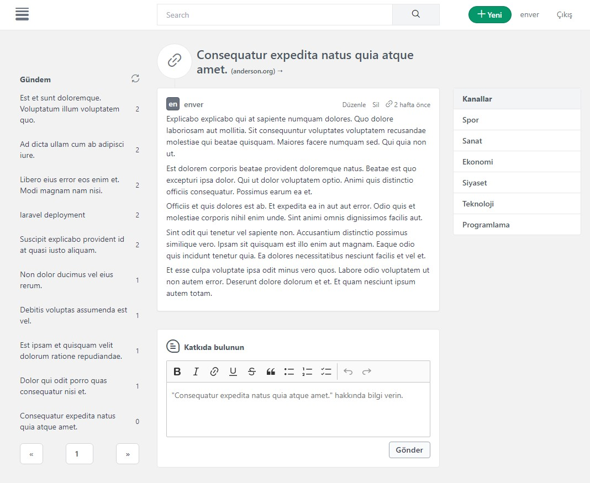

## Autodidact 
### Social Content Sharing Platform

### Environment
- Laravel 8.x
- PostgreSQL
- Redis
- TailwindCSS

### Homepage

### Discussion Page

### TODO
- [ ] Content edit/delete operations
- [ ] Popular content calculation algorithm
- [ ] Channels
- [ ] Rich Media Support
- [ ] Roles
- [ ] UI Improvements
- [ ] Scheduling & Queue
- [ ] Laravel 9 upgrade
- [ ] Livewire components
